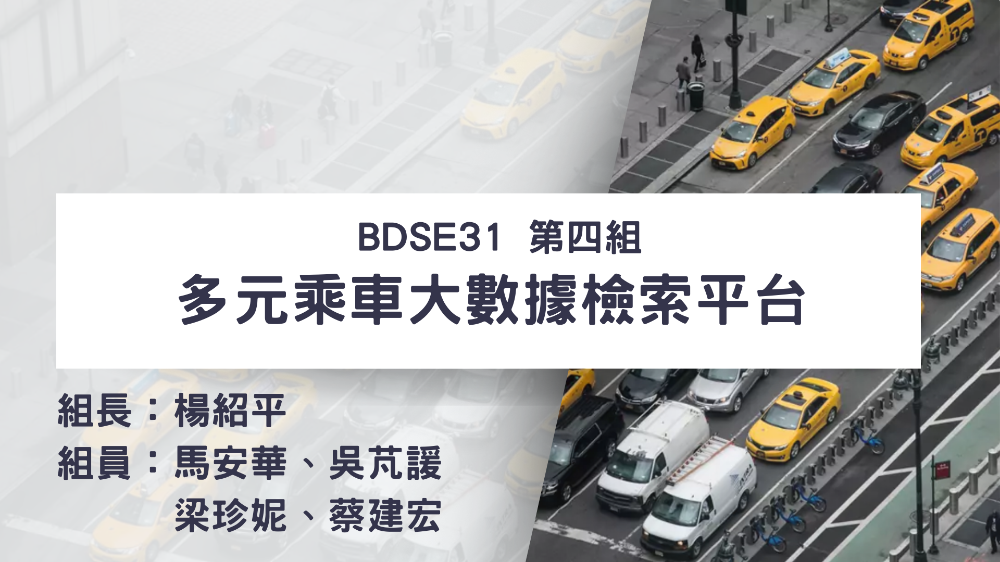

# Data Retrieval Platform of NYC Multimodal Ride-Hailing 

## 專案簡介
美國紐約市每月有約 2300 萬筆出租車乘車紀錄，相當於每天就有超過 70 萬的乘車需求，對於出租車企業，能夠精準的調度車輛，直接影響了其經營績效和市占率。本專案藉由分析紐約市計程車協會 (TLC) 的乘車紀錄資料集 (Trip Record Data)，開發預測不同時間、區域的乘車需求量之機器學習模型，並開發 **[網頁查詢、視覺化儀表板功能](https://youtu.be/8SKvn0fmuLI)**。  

## 目錄 & 檔案說明
- data_preprocessing: 資料預處理與特徵工程程式
- data_timeseries: 轉換時間序列資料之程式與資料，最終使用 TS6 版本進行機器學習訓練，TS10 版本用於預測
- datasets: 特徵工程與視覺化呈現所使用之資料集
- demo: 網站 Demo 錄影檔，亦可點擊**專案簡介**中的連結至 YouTube 觀看
- machine_learning: 機器學習訓練與預測程式
- presentation: 專案簡報檔，可直接點擊檔案 presentation.md 觀看
- spark_performance_testing: Spark 效能測試程式
- web: Demo 網站之前後端程式
- web_server_installation: 於 GCP 架設網頁伺服器之設定檔與流程

## 使用技術 (版本)
- 資料蒐集：
  - Requests: 2.31.0
  - BeautifulSoup4: 4.12.2
- 資料預處理：
  - Numpy: 1.25.2
  - Pandas: 1.5.3
  - PyArrow: 11.0.0
- 環境建置：
  - Ubuntu: 22.04 LTS
  - VMware Workstation 17 Player
  - Hadoop: 3.3.6
  - Spark: 3.2.4
  - GCP
- 機器學習模型建置：
  - scikit-learn: 1.2.2
  - PySpark: 3.4.1
  - Spark ML
- 視覺化呈現
  - HTML5
  - CSS3
  - JavaScript
  - Flask: 2.3.2
  - Leaflet: 1.9.4
  - plotly: 5.16.1
  - Dash: 2.12.1
